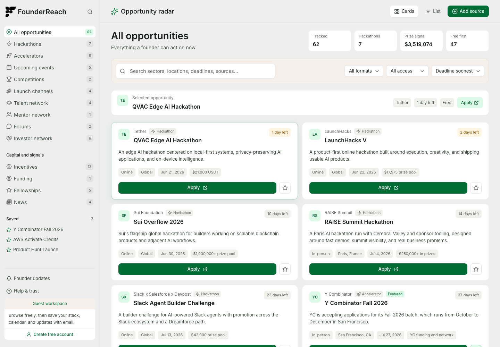
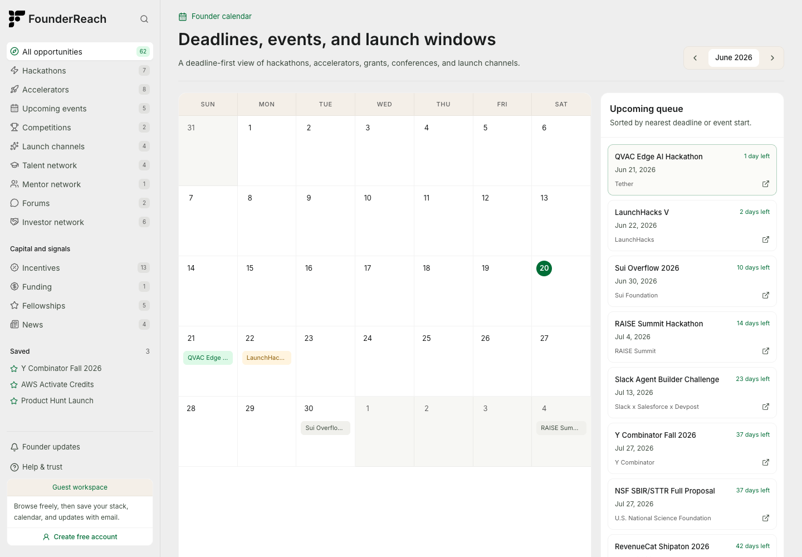
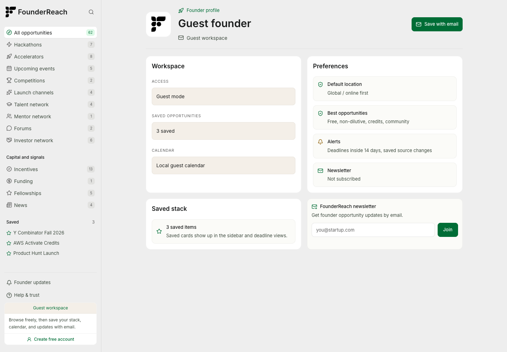

# FounderReach

FounderReach is a founder opportunity radar for discovering and organizing startup opportunities in one workspace. It tracks hackathons, accelerators, events, competitions, funding, startup credits, fellowships, launch channels, mentors, talent, investor networks, forums, and market-signal sources.

The app is built as a portfolio-grade Next.js product: a clean left-sidebar workspace, searchable opportunity feed, calendar view, guest mode, passwordless email access, newsletter signup, saved opportunities, analytics, and sync-ready provider integrations.

**Live site:** [founderreach.app](https://founderreach.app)

## Screenshots







## What It Does

- Surfaces founder-relevant opportunities across hackathons, accelerators, grants, credits, events, launch channels, talent, mentors, investor networks, forums, and news.
- Organizes opportunities by category, format, access type, deadline, location, value, source, and saved state.
- Provides a calendar-first view for deadlines, launch windows, and upcoming events.
- Supports guest browsing plus passwordless email sign-in/sign-up for saved opportunities and personalization.
- Includes newsletter capture for founder opportunity updates.
- Uses PostHog events for product analytics such as pageviews, searches, saves, category selection, and source clicks.
- Includes sync scaffolding for TinyFish Search/Fetch, Supabase persistence, review queues, and scheduled refreshes.
- Ships with Open Graph metadata, favicon, and a generated link-preview image for polished sharing.

## Tech Stack

- Next.js 15 App Router
- React 18 + TypeScript
- Tailwind CSS
- Zustand for workspace state
- Supabase SSR/Auth helpers and SQL migration scaffolding
- TinyFish Search/Fetch integration points
- Resend for email/newsletter workflows
- PostHog for analytics
- Netlify deployment with `@netlify/plugin-nextjs`
- GitHub Actions cron hook for opportunity sync

## Quick Start

```bash
npm install
cp .env.example .env.local
npm run dev
```

Open [http://localhost:3000](http://localhost:3000).

The app can run locally with seeded opportunity data while provider keys are empty. Add environment variables when you want live auth, sync, email, persistence, analytics, or logo enrichment.

## Environment Variables

All real values should live in `.env.local` for local development and in your hosting/provider dashboards for production. `.env.local` is intentionally ignored by git.

```bash
# TinyFish discovery and fetch
TINYFISH_API_KEY=
TINYFISH_BASE_URL=https://agent.tinyfish.ai/v1
TINYFISH_SEARCH_URL=https://api.search.tinyfish.ai
TINYFISH_FETCH_URL=https://api.fetch.tinyfish.ai
TINYFISH_WEBHOOK_SECRET=

# Supabase auth and persistence
NEXT_PUBLIC_SUPABASE_URL=
NEXT_PUBLIC_SUPABASE_ANON_KEY=
SUPABASE_SERVICE_ROLE_KEY=

# Scheduled sync
CRON_SECRET=
FOUNDERREACH_BASE_URL=
NEXT_PUBLIC_SITE_URL=https://founderreach.app

# Email and newsletter
RESEND_API_KEY=
NEWSLETTER_FROM_EMAIL=FounderReach <updates@founderreach.app>
NEWSLETTER_NOTIFY_EMAIL=

# Logos and analytics
NEXT_PUBLIC_LOGO_DEV_TOKEN=
NEXT_PUBLIC_POSTHOG_PROJECT_TOKEN=
NEXT_PUBLIC_POSTHOG_HOST=https://us.i.posthog.com
```

`NEXT_PUBLIC_*` variables are browser-visible by design. Do not put private secrets in them.

## Core Routes

- `/` - product landing page
- `/dashboard` - searchable opportunity radar
- `/calendar` - deadline and event calendar
- `/profile` - guest/email workspace settings, saved stack, newsletter
- `/data` - source and sync surface
- `/login` and `/signup` - passwordless email access

## API Surface

- `GET /api/opportunities` - list current opportunity graph
- `POST /api/opportunities/sync` - trigger opportunity sync
- `GET /api/opportunities/hacklist` - import Hacklist-style source data
- `GET /api/cron/opportunity-sync` - protected scheduled refresh endpoint
- `GET/POST /api/me/saved-opportunities` - saved opportunity personalization
- `GET/POST /api/me/calendar-preferences` - user calendar preferences
- `POST /api/newsletter` - newsletter signup
- `POST /api/webhooks/tinyfish` - TinyFish webhook receiver

## Data Model

The Supabase migration lives in:

```bash
supabase/migrations/002_opportunity_graph.sql
```

It includes tables for opportunities, saved opportunities, newsletter subscribers, sync runs, sync candidates, and calendar preferences.

## Scripts

```bash
npm run dev      # Start local development
npm run build    # Build production bundle
npm run start    # Run production build locally
npm run lint     # Run ESLint
```

## Deployment

The project is configured for Netlify:

- Build command: `npm run build`
- Publish directory: `.next`
- Plugin: `@netlify/plugin-nextjs`

Set the production environment variables in Netlify before enabling live sync, Supabase writes, email, analytics, and cron.

## Repository Safety

- Real secrets are not committed.
- `.env.local` is gitignored.
- `.env.example` contains placeholders only.
- Public browser keys use the `NEXT_PUBLIC_*` prefix intentionally.
- The repo includes `SECURITY.md` for responsible reporting guidance.

## License

MIT License. See [LICENSE](LICENSE).
